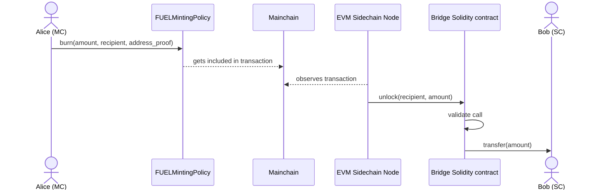

# Overview

An incoming cross-chain transaction is a process in which some native tokens (SC_TOKEN)
disappear from the main chain and are added to a specified sidechain address.

These parties are involved:

- FUELMintingPolicy - a Plutus script that validates the burn operation
- EVM Sidechain validator nodes - they observe the main chain (they are main chain followers) and participate in the sidechain
- [trustless-sidechain CTL](../reference/trustless-sidechain.md#ctl) - a toolkit that knows FUELMintingPolicy and enables users to interact with it
- the user - owns SC_TOKEN and burns it to initiate the transaction.

The user burns their SC_TOKEN to FUELMintingPolicy using trustless-sidechain CTL, then the EVM Sidechain node observes this fact
and records it as a transaction in the bridge contract that transfers tokens to the EVM recipient address,
completing the incoming cross-chain transaction.

## Execution of incoming transaction

The procedure for performing incoming transactions is as follows:

1. User **burns** an amount of SC_TOKEN token specifying the sidechain address of the recipient. See [burn](#burn) for details.
2. EVM Sidechain node follows the main chain and the user [can observe lifecycle of incoming transactions](#observing-incoming-transactions).
3. After the Cardano main chain progresses, and the transaction is stable, a sidechain validator validates it
   and transfers the specified number of tokens (multiplied by `TOKEN_CONVERSION_RATE` specified in the bridge contract)
   to the recipient.

### Burn

The burn transaction on the main chain doesn't transfer tokens to another address, but records the fact that they were destroyed.
This fact can be annotated with some additional data.

The incoming transaction starts with burning the SC_TOKEN tokens using FUELMintingPolicy, with the sidechain recipient address specified as additional data.

The trustless-sidechain CTL that contains FUELMintingPolicy Plutus code is used to create and submit the Cardano transaction.

Burning can also be done by using the configured **sc-evm-cli** application, which uses CTL internally:

```commandline
sc-evm-cli burn-sc-token --signing-key-file <path to signing key> --recipient <sidechain adderess> --amount <of SC_TOKEN to burn>
```

### Observing incoming transactions

From the user perspective, the lifecycle of an incoming transaction spans three phases: _pending_, _queued_ and
_executed_.
Transaction is _pending_ after the **burn** action is done, and until the main chain block in which the burn was recorded is stable.
It's _queued_ from the time the main chain block becomes stable until it's observed by the EVM sidechain node and added to a sidechain block.
After being added to a sidechain block transaction, the incoming transaction is considered as _executed_.

**sc-evm-cli** has the **pending-txs** command for observing _pending_ and _queued_ transactions, **recipient** filter is available.

```commandline
sc-evm-cli pending-txs --recipient <sidechain adderess>
```

**search-incoming-txs** command allows to get details of _executed_ transactions.

```commandline
sc-evm-cli search-incoming-txs --help
```

The _pending_ state is only for users to immediately observe effects of their burn operation,
the EVM sidechain node logic depends only on what cardano-follower module considers stable.


