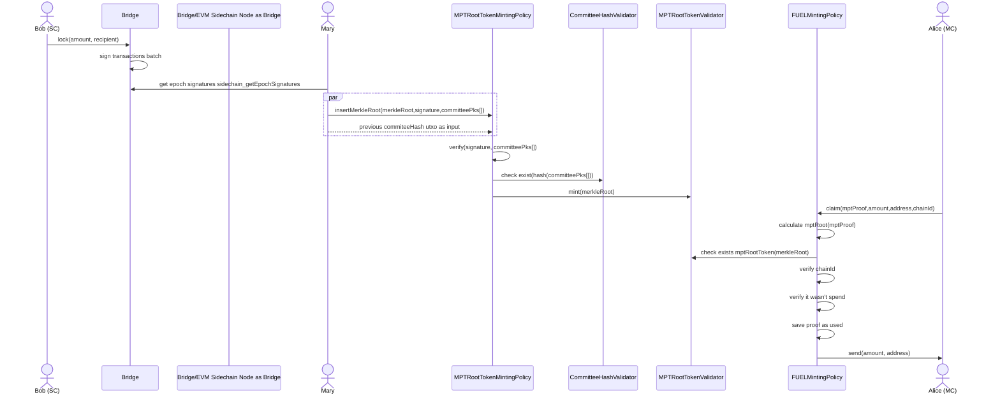

# Overview

These parties are involved:

- bridge contract - a Solidity contract present in the sidechain genesis block
- EVM Sidechain validator nodes - participate in the sidechain, allow interaction with the bridge contract, provide data required by Plutus scripts to finalize outgoing transactions
- relay - an interested party that gets data from the EVM Sidechain and posts it to the main-chain Plutus scripts
- Plutus scripts - a collection of on-chain Plutus scripts
- [trustless-sidechain CTL](../reference/trustless-sidechain.md#ctl) - a toolkit that knows Plutus scripts and facilitates users for interactions with it
- the user - owns EVM tokens and locks them to initiate the transaction.

The procedure for performing outgoing transactions is as follows:

1. Users perform `lock(amount, recipient)` transactions on the **bridge contract**, which stores
   them for the current or next epoch batch
   (see [sidechain epoch phases](sidechain-epoch-phases.md)). Locking details are presented [below](#locking-tokens-for-an-outgoing-transaction).
2. The current epoch batch is signed by the current committee in the _handover_ phase. It's non-trivial, explained in a [separate paragraph](#Signing current transactions batch) 
3. After the epoch is past, the relay gets the **epoch signatures** using
   `sidechain_getEpochSignatures(sidechain epoch)` RPC endpoint which returns **outgoing transactions signatures**.
   These signatures are composed of **Merkle root hash** and a list of signatures
   (committee member public key and ECSDA signature of **Merkle root hash**)
4. The relay then [posts obtained **Merkle root hash** and signatures to the mainchain contract](#posting-signatures-to-the-main-chain).
5. When it's done, users who have previously `lock`ed funds in the sidechain can use RPC endpoint
   `sidechain_getOutgoingTransactions(sidechain epoch)` to find **tx id** and
   `sidechain_getOutgoingTxMerkleProof(sidechain epoch, tx id)` to obtain **Merkle proof** for it.
6. The last step is to [execute a **claim** operation on the main chain contract](#claiming-tokens-on-the-main-chain) to complete the transfer of SC_TOKEN to the
   main-chain recipient.

## Locking tokens for an outgoing transaction

The number of tokens locked must be a multiple of `TOKEN_CONVERSION_RATE` as defined in the deployed Solidity bridge contract.

Users can load contract ABI to [Remix IDE](https://remix-project.org/) and create a transaction there,
then attach [metamask](https://metamask.io/) to Remix IDE to sign and post transaction.

## Signing current transactions batch

The current transactions batch can contain transactions from the _closed transaction batch_ and the _handover_ phases of the previous epoch
and transactions from the _regular_ phase of the current epoch. When the _handover_ phase of the current epoch starts, sidechain nodes
are gathering signatures for [committee handover](committee-handover-flow.md) and the current outgoing transactions batch.
A Merkle tree is created from elements made of: transactions' data (recipient, amount, index in batch, **previous Merkle root hash**) in the current batch,
where **previous Merkle root hash** is the previous value posted to the main chain.
The Merkle root hash of the current tree is then signed, and added in the sidechain transaction, by each committee member that has a slot assigned in the _handover_ phase.
This way, at the end of the epoch, there are signatures of enough committee members recorded in the sidechain and the main chain can be updated with the data that
allows users to prove they have executed `lock` in the sidechain.

## Posting signatures to the main chain

This step involves using CTL interface to a main-chain MPTRootTokenMintingPolicy contract and is performed by participants of the sidechain.
The message contains sidechain parameters - to identify the sidechain, previous Merkle root hash - to ensure root hashes are inserted in the correct order, Merkle root hash
for the current batch, and the list of committee members' signatures.

Usage: TBD. The CTL endpoint is currently not usable.

## Claiming tokens on the main chain

TBD. It's not currently implemented, but will be possible with `sidechain_cli.py` similar to [burn](bridge-transfer-mainchain-to-sidechain.md#burn)
This operation utilizes trustless-sidechain CTL to interact with MPTRootMintingPolicy script. This script verifies that a given proof has not been used already
and mints SC_TOKEN tokens for the main-chain
recipient.

To be continued, update this diagram with EVM node actor.

