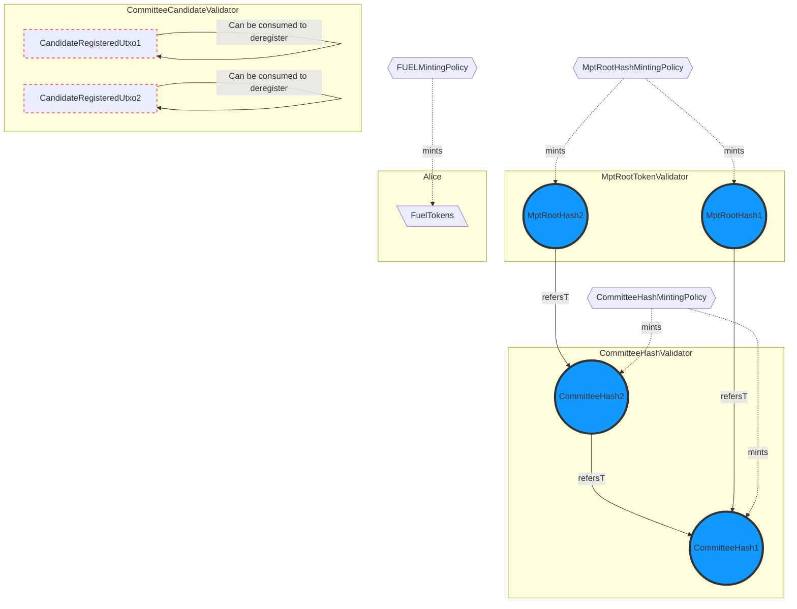

```mermaid
flowchart TD
  subgraph CommitteeHashValidator
    CommitteeHash1((CommitteeHash1))
    CommitteeHash2((CommitteeHash2)) --refersTo--> CommitteeHash1
    style CommitteeHash1 fill:#19f,stroke:#333,stroke-width:4px
    style CommitteeHash2 fill:#19f,stroke:#333,stroke-width:4px
  end

  subgraph MptRootTokenValidator
    MptRootHash1((MptRootHash1)) --refersTo--> CommitteeHash1
    MptRootHash2((MptRootHash2)) --refersTo--> CommitteeHash2
    style MptRootHash1 fill:#19f,stroke:#333,stroke-width:4px
    style MptRootHash2 fill:#19f,stroke:#333,stroke-width:4px
  end

  CommitteeHashMintingPolicy{{CommitteeHashMintingPolicy}} -.mints.-> CommitteeHash1
  CommitteeHashMintingPolicy -.mints.-> CommitteeHash2

  MptRootHashMintingPolicy{{MptRootHashMintingPolicy}}-.mints.-> MptRootHash1
  MptRootHashMintingPolicy-.mints.-> MptRootHash2

  FUELMintingPolicy{{FUELMintingPolicy}} -.mints.-> FuelTokens

  subgraph Alice
    FuelTokens[\FuelTokens\]
  end

  subgraph CommitteeCandidateValidator
    CandidateRegisteredUtxo1
    CandidateRegisteredUtxo2
    style CandidateRegisteredUtxo1 style id2 fill:#bbf,stroke:#f66,stroke-width:2px,stroke-dasharray: 5 5
    style CandidateRegisteredUtxo2 style id2 fill:#bbf,stroke:#f66,stroke-width:2px,stroke-dasharray: 5 5
    CandidateRegisteredUtxo1--Can be consumed to deregister-->CandidateRegisteredUtxo1
    CandidateRegisteredUtxo2--Can be consumed to deregister-->CandidateRegisteredUtxo2
  end
```
