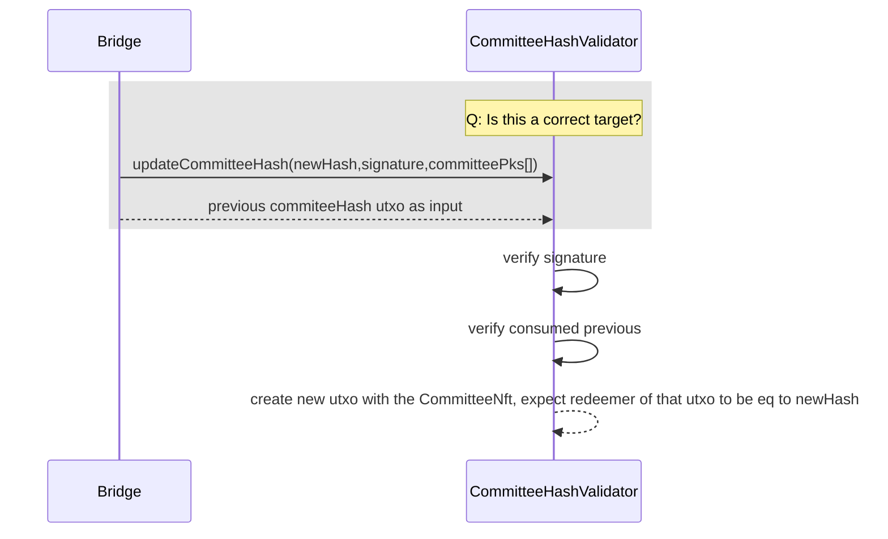

```mermaid
sequenceDiagram
    participant Bridge
    participant CommitteeHashValidator
    rect rgba(0,0,0,0.1)
      Note over CommitteeHashValidator: Q: Is this a correct target?
      Bridge->>CommitteeHashValidator: updateCommitteeHash(newHash,signature,committeePks[])
      Bridge-->>CommitteeHashValidator: previous commiteeHash utxo as input
    end
    CommitteeHashValidator->>CommitteeHashValidator: verify signature
    CommitteeHashValidator->>CommitteeHashValidator: verify consumed previous
    CommitteeHashValidator-->>CommitteeHashValidator: create new utxo with the CommitteeNft, expect redeemer of that utxo to be eq to newHash
```
