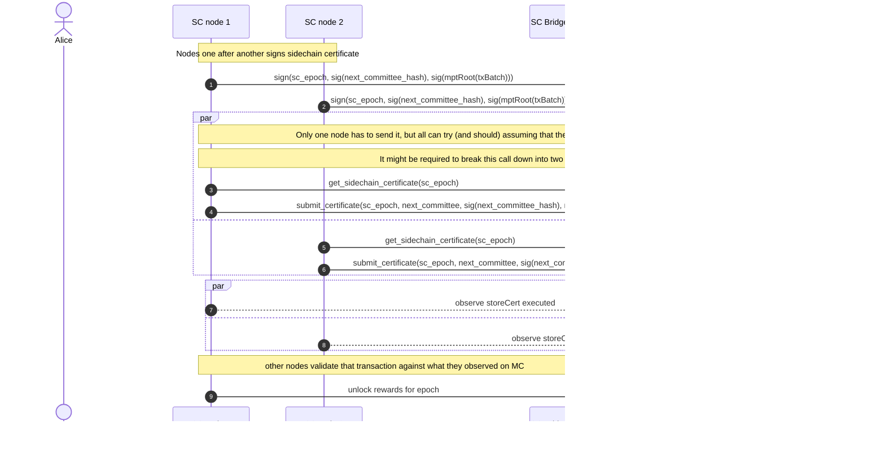

## Flow: how to move SC_TOKEN from Side Chain to Main Chain.

1\. User Alice wants to move 10 SC_TOKEN to Main Chain

2\. & 3. SC Node 1 requests transactions that should be moved to Main Chain

6\. SC Node 1 puts end of epoch data (committee proof, transactions proof) to the ledger

8\. SC Node 1 fetches end of epoch data from Side Chain ledger

9\. SC Node 1 posts end of epoch data to Main Chain, triggers MC to verify posted certificate

12\. User Alice claims 10 native token SC_TOKEN

## Flow: how to reward epoch validator

1\. SC Node 1 puts end of epoch data (committee proof, transactions proof) to the ledger

3\. SC Node 1 fetches end of epoch data from Side Chain ledger

4\. SC Node 1 posts end of epoch data to Main Chain, triggers MC to verify posted certificate

7\. SC Node 1 observes MC verifying the posted end of epoch certificates

9\. Previous epoch nodes are awarded SC_TOKEN accordingly to blocks produced in the previous Side Chain epoch
