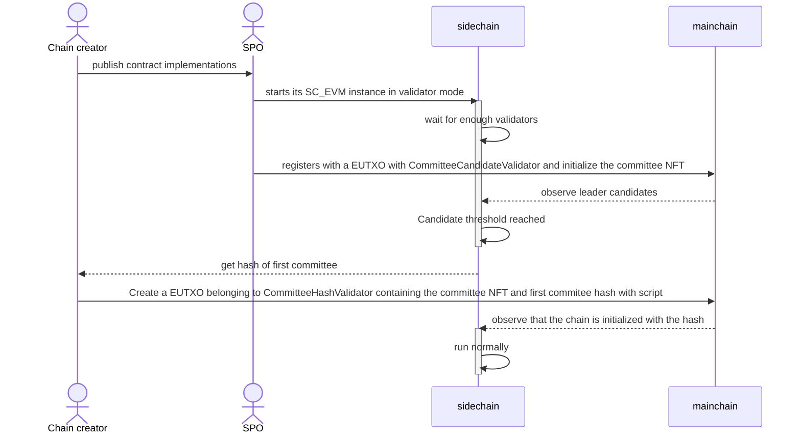

```mermaid
sequenceDiagram
    actor ChainCreator as Chain creator
    actor SPO
    participant sidechain
    participant mainchain
    ChainCreator ->> SPO: publish contract implementations
    SPO ->> sidechain: starts its SC_EVM instance in validator mode
    activate sidechain
    sidechain ->> sidechain: wait for enough validators
    SPO ->> mainchain: registers with a EUTXO with CommitteeCandidateValidator and initialize the committee NFT
    mainchain -->> sidechain: observe  leader candidates
    sidechain ->> sidechain: Candidate threshold reached
    deactivate sidechain
    sidechain -->> ChainCreator: get hash of first committee
    ChainCreator ->> mainchain: Create a EUTXO belonging to CommitteeHashValidator containing the committee NFT and first commitee hash with script
    mainchain -->> sidechain: observe that the chain is initialized with the hash
    activate sidechain
    sidechain ->> sidechain: run normally
    deactivate sidechain
```
