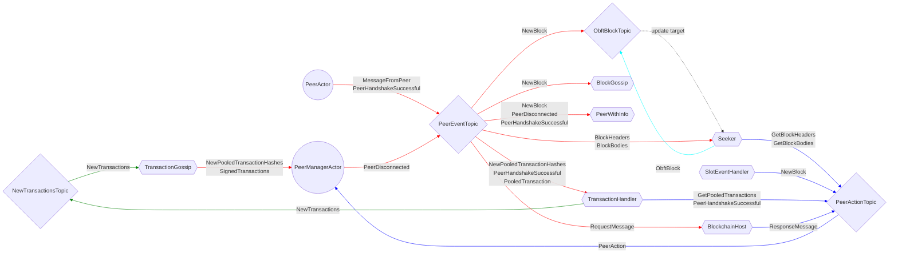

# Flows of messages between Topics

- In red: PeerEvent
- In blue: PeerAction
- In green: NewTransactions
- In cyan: ObftBlock

```mermaid
flowchart LR

  %% Topics
  NewTransactionsTopic{NewTransactionsTopic}
  ObftBlockTopic{ObftBlockTopic}
  PeerActionTopic{PeerActionTopic}
  PeerEventTopic{PeerEventTopic}

  %% Actors
  PeerManagerActor((PeerManagerActor))
  PeerActor((PeerActor))

  %% Others objects
  BlockchainHost{{BlockchainHost}}
  BlockGossip{{BlockGossip}}
  PeerWithInfo{{PeerWithInfo}}
  Seeker{{Seeker}}
  SlotEventHandler{{SlotEventHandler}}
  TransactionGossip{{TransactionGossip}}
  TransactionHandler{{TransactionHandler}}

  %% Relations
  PeerActor --MessageFromPeer\nPeerHandshakeSuccessful--> PeerEventTopic

  PeerEventTopic --NewBlock--> BlockGossip

  PeerEventTopic --NewBlock--> ObftBlockTopic
  ObftBlockTopic -.update target.-> Seeker

  PeerEventTopic --BlockHeaders\nBlockBodies--> Seeker
  Seeker --GetBlockHeaders\nGetBlockBodies--> PeerActionTopic

  SlotEventHandler --NewBlock--> PeerActionTopic

  PeerActionTopic --PeerAction--> PeerManagerActor

  PeerEventTopic --NewPooledTransactionHashes\nPeerHandshakeSuccessful\nPooledTransaction--> TransactionHandler
  TransactionHandler --GetPooledTransactions\nPeerHandshakeSuccessful--> PeerActionTopic
  TransactionHandler --NewTransactions--> NewTransactionsTopic

  NewTransactionsTopic --NewTransactions--> TransactionGossip
  TransactionGossip --NewPooledTransactionHashes\nSignedTransactions--> PeerManagerActor

  PeerEventTopic --NewBlock\nPeerDisconnected\nPeerHandshakeSuccessful--> PeerWithInfo

  PeerEventTopic --RequestMessage--> BlockchainHost
  BlockchainHost --ResponseMessage--> PeerActionTopic

  PeerManagerActor --PeerDisconnected--> PeerEventTopic

  Seeker --ObftBlock--> ObftBlockTopic

  %% Styles
  linkStyle 0 stroke:red;
  linkStyle 1 stroke:red;
  linkStyle 2 stroke:red;
  linkStyle 4 stroke:red;
  linkStyle 5 stroke:blue;
  linkStyle 6 stroke:blue;
  linkStyle 7 stroke:blue;
  linkStyle 8 stroke:red;
  linkStyle 9 stroke:blue;
  linkStyle 10 stroke:green;
  linkStyle 11 stroke:green;
  linkStyle 12 stroke:red;
  linkStyle 13 stroke:red;
  linkStyle 14 stroke:red;
  linkStyle 15 stroke:blue;
  linkStyle 16 stroke:red;
  linkStyle 17 stroke:cyan;
```
