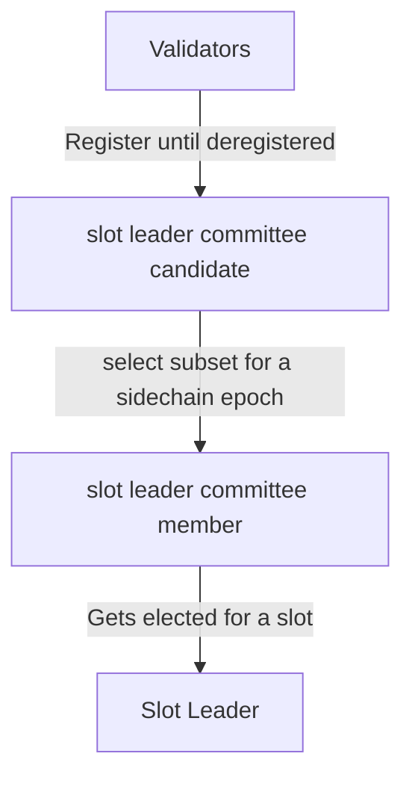

# Terminology

## Slot leader and validator

On the network layer we can distinguish two types of nodes - validators and passives.
Validator nodes are the ones that can potentially produce blocks. To do that they need to be configured with their own unique private keys.
Passive nodes don't produce blocks, they observe what is happening in the network and relay valid blocks to their peers.

On the consensus layer, validators can have different roles depending on the state of the network and time.
First, a validator can register itself to participate in the network consensus, to become a `slot leader committee candidate`.
For each sidechain epoch we calculate a subset of validators from the candidates list. That subset is called `slot leader committee member`.
Finally, for each slot within a given sidechain epoch a single committee member will get selected as a `slot leader`.

## Cross-chain transactions

Those are simply transactions that go between the sidechain and the main chain.
We distinguish two types of such transactions:

1. Outgoing transactions

   Transactions that are initiated on the sidechain and target an account on the main chain

2. Incoming transactions

   Transactions that are initiated on the main chain and target an account on the sidechain
